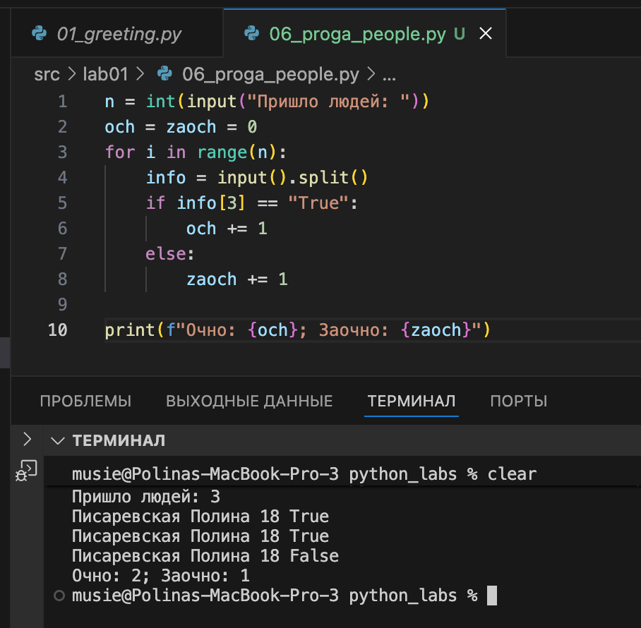

# Лабораторные работы 

Данный репозиторий содержит мои решения лабораторных работ по предмету **Программирование и алгоритмизация**.  
Все задачи выполняются на языке **Python** и структурированы по папкам с лабораторными.

---

## Структура репозитория

```
python_labs/
├─ README.md           # краткое описание + примеры запуска
├─ src/                # здесь — все скрипты по заданиям
|  ├─ lab01
|  |   ├─ ex01.py
|  |   ├─ ex02.py
|  |   ........
|  |   └─ ex05.py
|  ├─ lab02
|  ........
|  └─ lab10
└─ images/             # сюда — скриншоты работы программ
   ├─ lab01
   |   ├─ img01.png
   |   ........
   |   └─ img05.png
   ├─ lab02
   ........
   └─ lab10
```

## Код — в src/, скриншоты — в images/.

# Задание 1 


# Задание 2


# Задание 3


# Задание 4


# Задание 5


# Задание 6


