# Писаревская Полина Алексеевна БИВТ-25-4

---

# ЛАБОРАТОРНАЯ РАБОТА №1

# Задание 1 
```python
name = input("Имя: ")
age = int(input("Возраст: "))
print(f"Привет, {name}! Через год тебе будет {age + 1}.")
```


# Задание 2
```python
a = float(input("A: ").replace(",", "."))
b = float(input("B: ").replace(",", "."))
print(f"sum={a + b}; avg={(a + b) / 2}")
```


# Задание 3
```python
m = int(input("Минуты: "))
print(f"{m // 60:02d}:{m % 60:02d}")
```


# Задание 4
```python
price = float(input("Цена: "))
discount = float(input("Скидка: "))
vat = float(input("НДС: "))
base = price * (1 - discount / 100)
vat_amount = base * (vat / 100)
total = base + vat_amount
print(f"База после скидки: {base:.2f} ₽")
print(f"НДС: {vat_amount:.2f} ₽")
print(f"Итого к оплате: {total:.2f} ₽")
```


# Задание 5
```python
name = input("ФИО:").strip()
name1 = name.split()
name2 = ' '.join(name1)
print(f"Инициалы: {name1[0][0]}{name1[1][0]}{name1[2][0]}.")
print(f"Длина: {len(name2)}")
```


---

# ЛАБОРАТОРНАЯ РАБОТА №2


# Задание 1 -> arrays

# 1 min_max

```python
def min_max(nums: list[float | int]) -> tuple[float | int, float | int]:
    if len(nums) == 0:
        return ValueError
    mn = 9e6 
    mx = -9e6 
    for i in range(len(nums)):
        if nums[i] < mn:
            mn = nums[i]
        if nums[i] > mx:
            mx = nums[i]
    return tuple([mn, mx])
print(min_max())
```
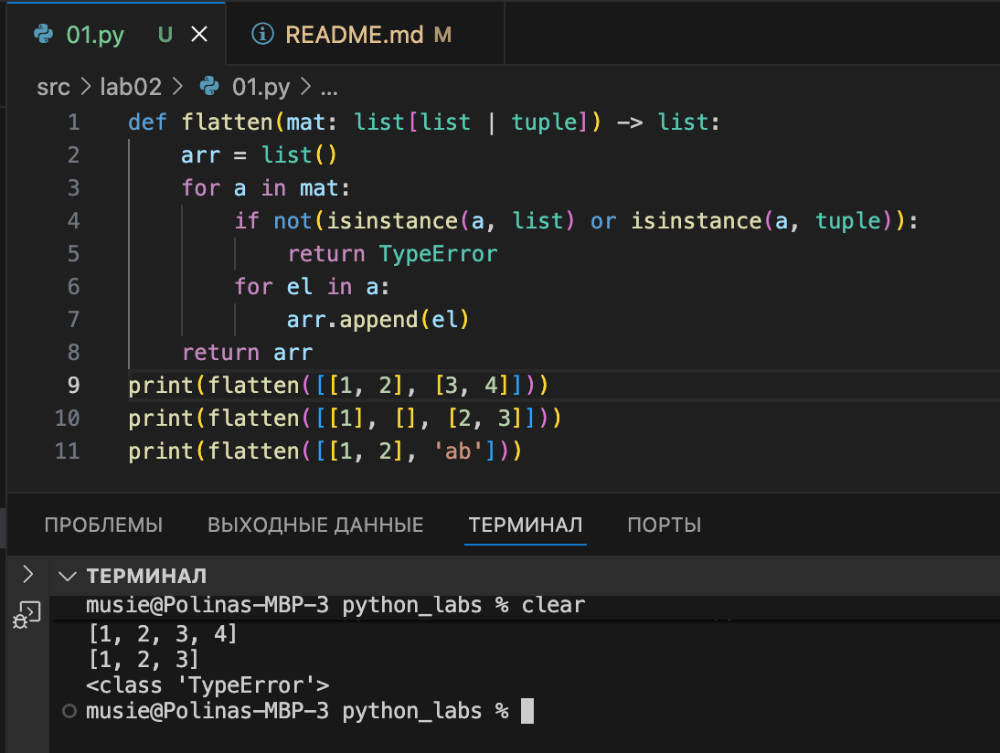

# 2 unique_sorted

```python
def unique_sorted(nums1: list[float | int]) -> list[float | int]:
    unique_nums = set(nums1)
    return sorted(unique_nums)
print(unique_sorted())
```
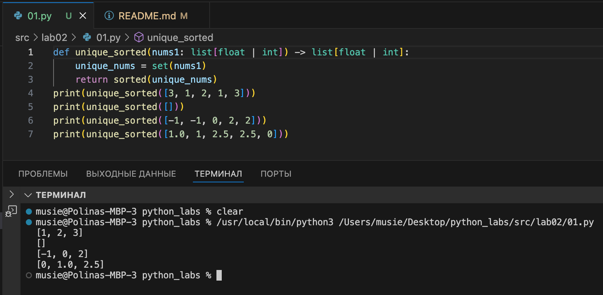

# 3 flatten

```python
def flatten(mat: list[list | tuple]) -> list:
    arr = list()
    for a in mat:
        if not(isinstance(a, list) or isinstance(a, tuple)):
            return TypeError
        for el in a:
            arr.append(el)
    return arr 
print(flatten())
```


# Задание 2 -> matrix

# Вспомогательная функция 
## С ее помощью проверяю длину строк матрицы. Если длина строк разная, значит матрица - рваная, возвращаю ValueError.

```python
def dliny(mat):
    if any(len(mat[0]) != len(mat[s]) for s in range(len(mat))):
        return False
    return True
```

# 1 transpose

```python
def transpose(mat: list[list[float | int]]) -> list[list]:
    if len(mat) == 0:
        return []
    if dliny(mat) == False:
        return ValueError
    newmat = [[0 for stro in range(len(mat))] for stol in range(len(mat[0]))]
    for strok in range(len(mat)):
        for stolb in range(len(mat[strok])):
            newmat[stolb][strok] = mat[strok][stolb]
    return newmat
print(transpose())
```
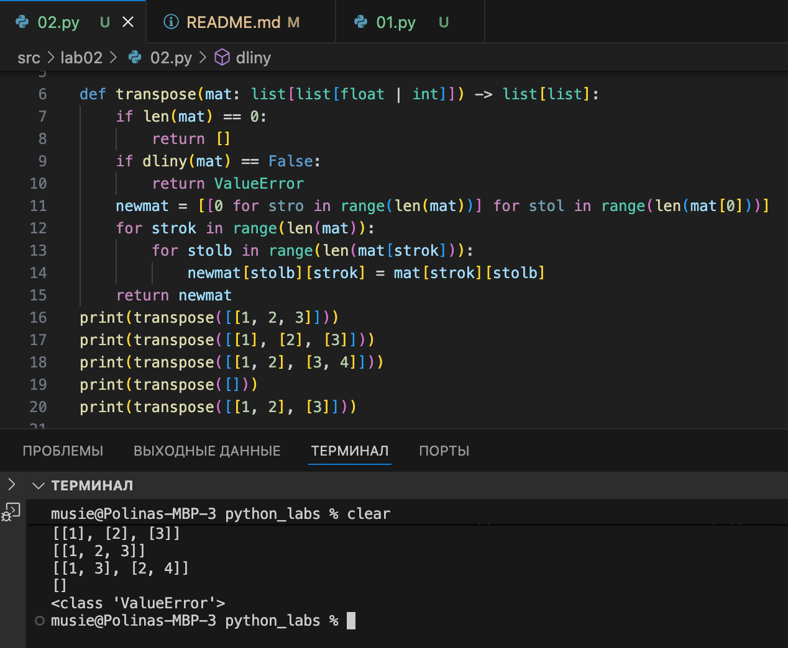

# 2 row_sums

```python
def row_sums(mat: list[list[float | int]]) -> list[float]:
    if len(mat) == 0:
        return []
    if dliny(mat) == False:
        return ValueError
    sums = []
    for i in mat:
        sums.append(sum(i))
    return sums
print(row_sums())
```
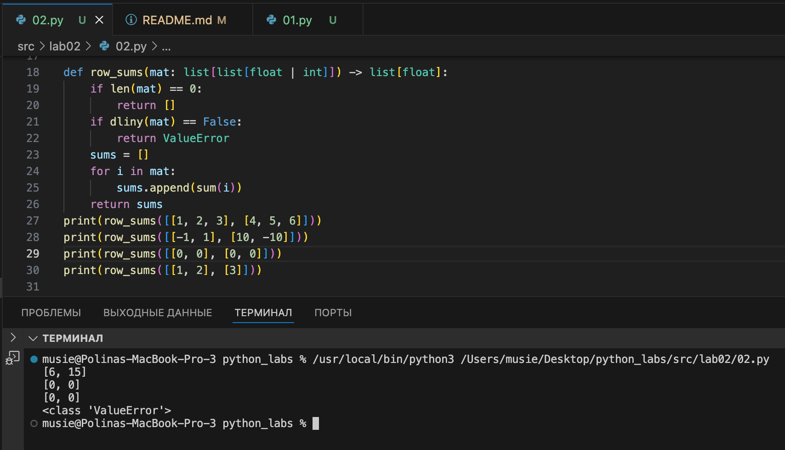

# 3 col_sums

```python
def col_sums(mat: list[list[float | int]]) -> list[float]:
    if len(mat) == 0:
        return []
    if dliny(mat) == False:
        return ValueError
    sums = []
    row_len = len(mat[0])
    return [sum(row[j] for row in mat) for j in range(row_len)]
print(col_sums())
```
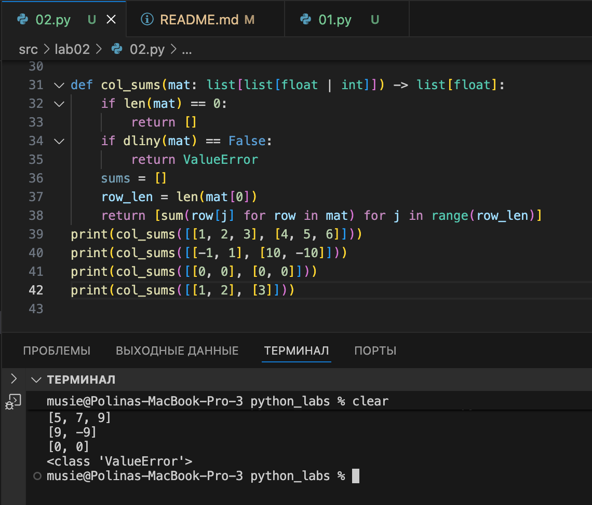


# Задание 3 -> tuples

```python
def format_record(rec: tuple[str, str, float]) -> str:
    name_processing = rec[0].strip().split()
    final_name = ''
    if len(name_processing) == 1:
        final_name = f"{name_processing[0][0].upper()}{name_processing[0][1:]}"
    elif len(name_processing) == 2:
        final_name = f"{name_processing[0][0].upper()}{name_processing[0][1:]} {name_processing[1][0:1].upper()}."
    elif len(name_processing) == 3:
        final_name = f"{name_processing[0][0].upper()}{name_processing[0][1:]} {name_processing[1][0:1].upper()}. {name_processing[2][0:1].upper()}."
    else:
        return ValueError
    group = ''
    group_processing = rec[1].strip()
    if group_processing == '':
        return ValueError
    else:
        group = group_processing
    gpa = float(rec[2])
    if not(isinstance(gpa, float)):
        return TypeError
    return f"{final_name}, гр. {group}, GPA: {gpa:.2f}"   
print(format_record(()))
```
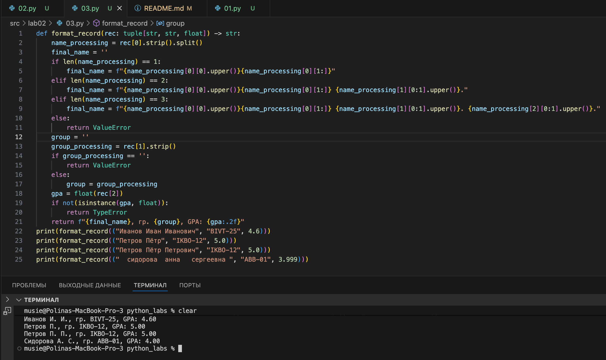

---

# ЛАБОРАТОРНАЯ РАБОТА №3

# Задание A
###  Запуск из терминала: `python3 -m src.lab03.A`
```python
from src.lib.text import normalize, tokenize, top_n, count_freq


print(normalize("ПрИвЕт\nМИр\t"))
print(normalize("ёжик, Ёлка", yo2e=True))
print(normalize("Hello\r\nWorld"))
print(normalize("  двойные   пробелы  "))


print(tokenize("привет мир"))
print(tokenize("hello,world!!!"))
print(tokenize("по-настоящему круто"))
print(tokenize("2025 год"))
print(tokenize("emoji 😀 не слово"))


print(top_n(count_freq(["a", "b", "a", "c", "b", "a"]), n=2))
print(top_n(count_freq(["bb", "aa", "bb", "aa", "cc"]), n=2))
```
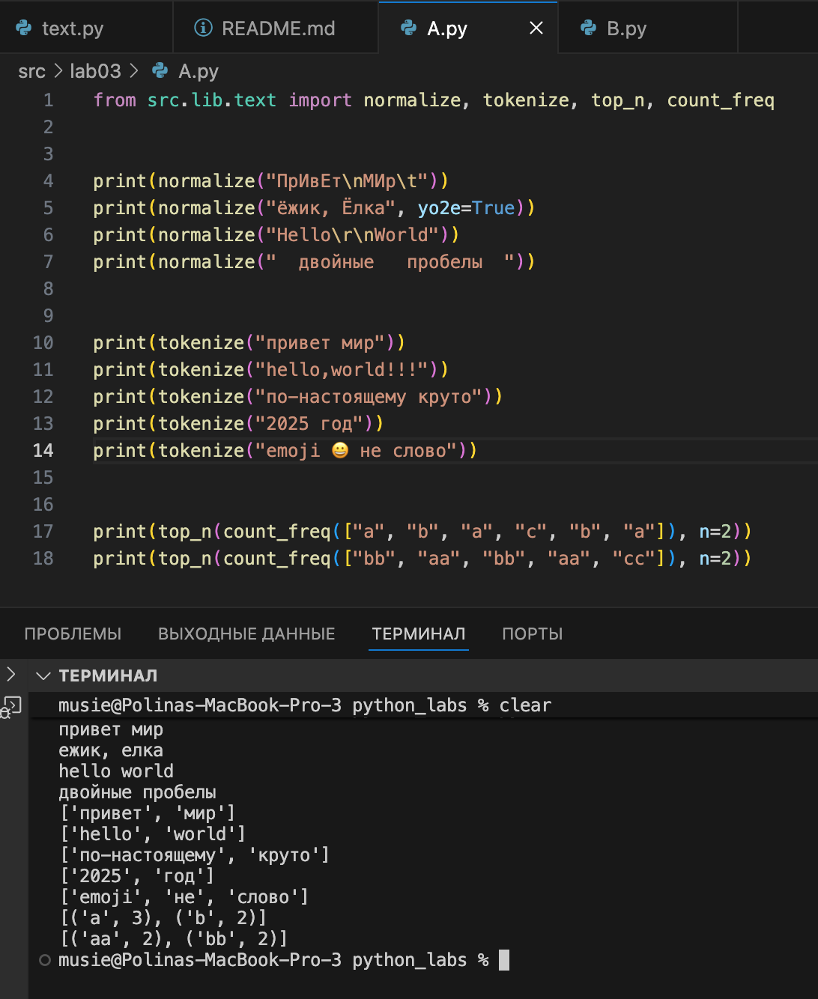

# Задание B
###  Запуск из терминала: `python3 -m src.lab03.B < src/lab03/input.txt`


```python
import sys
from src.lib.text import count_freq, top_n, normalize, tokenize

text = sys.stdin.read()

tokens = tokenize(text=normalize(text=text))
top = top_n(count_freq(tokens))

print(f"Всего слов: {len(tokens)}")
print(f"Уникальных слов: {len(set(tokens))}")
print("Топ-5:")
for w, c in top:
    print(f"{w}:{c}")
```
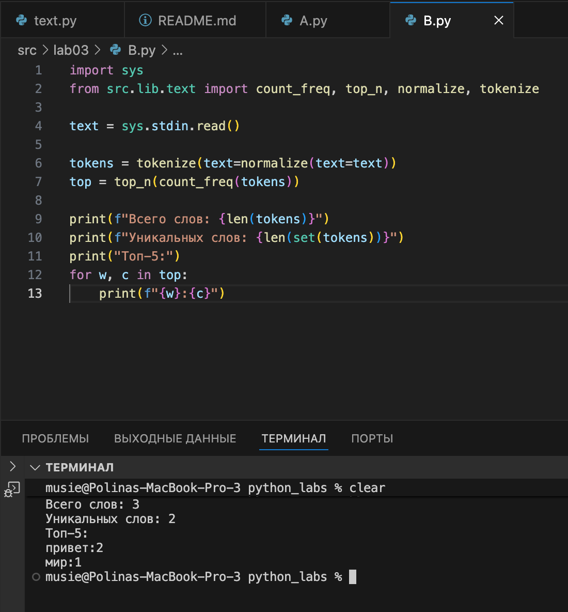

---

# ЛАБОРАТОРНАЯ РАБОТА №4
# Задание А -> `src/lab04/io_txt_csv.py`

```python
import csv
from pathlib import Path
from typing import Iterable, Sequence

def read_text(path: str | Path, encoding: str = "utf-8") -> str:
    p = Path(path)
    return p.read_text(encoding=encoding)

def write_csv(rows: Iterable[Sequence], path: str | Path,
              header: tuple[str, ...] | None = None) -> None:
    p = Path(path)
    rows = list(rows)
    if rows:
        cols = len(rows[0])
        for r in rows:
            if len(r) != cols:
                raise ValueError("Разная длина строк")
    with p.open("w", newline="", encoding="utf-8") as f:
        w = csv.writer(f)
        if header is not None:
            w.writerow(header)
        for r in rows:
            w.writerow(r)
```

# Задание В -> `src/lab04/text_report.py`
## Запуск из терминала `python3 -m src.lab04.text_report`. 
```python
from src.lab04.io_txt_csv import read_text, write_csv
from src.lib.text import count_freq, top_n, normalize, tokenize
from pathlib import Path

def text_progress(text):
    tokens = tokenize(normalize(text))
    freq = count_freq(tokens)
    return tokens, freq

in_path = Path("src/data/lab04/input.txt")
out_path = Path("src/data/lab04/report.csv")

text = read_text(in_path)
tokens, freq = text_progress(text)
write_csv(top_n(freq, len(freq)), out_path, header=("word", "count"))

print("Всего слов:", len(tokens))
print("Уникальных слов:", len(freq))
print("Топ-5:")
for word, count in top_n(freq, 5):
    print(f"{word}: {count}")
```

## Выполнение:

### Вход -> `data/lab04/input.txt`:
Привет, мир!!! Привет!

### Вывод в терминале:
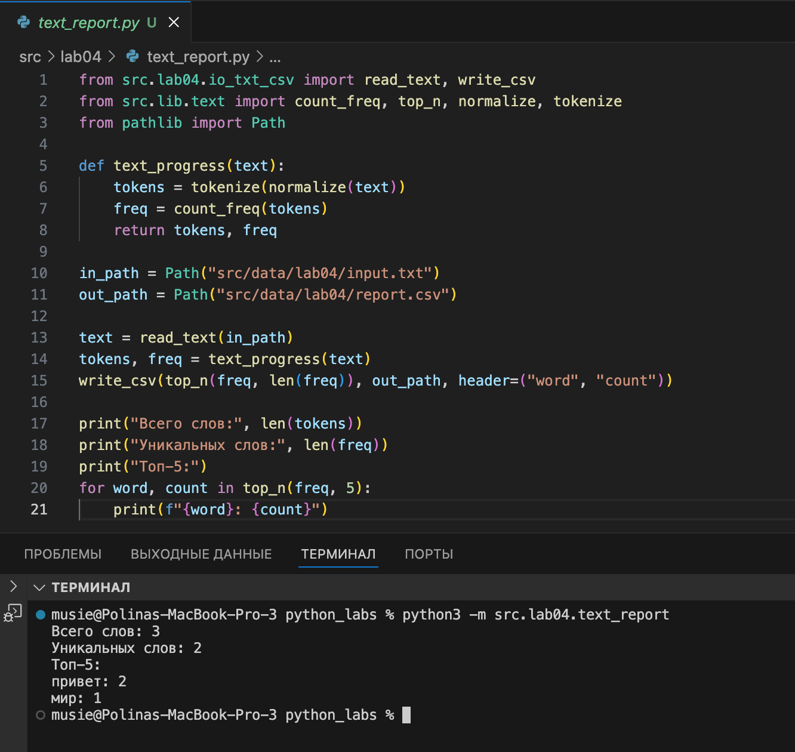

### Отчет CSV -> `data/lab04/report.csv`:


---

# ЛАБОРАТОРНАЯ РАБОТА №5
# Задание А — JSON ↔ CSV
```python
import json, csv
from pathlib import Path

def json_to_csv(json_path: str, csv_path: str) -> None:
    jp = Path(json_path)
    if jp.suffix != ".json":
        raise ValueError("Неверный тип файла")
    if not jp.exists():
        raise FileNotFoundError("Файл не найден")
    with open(json_path,"r", encoding="utf-8") as f:
        data = json.load(f)
    if len(data)==0:
        raise ValueError("Пустой JSON")
    headers = list(data[0])
    with open(csv_path, "w", newline="", encoding="utf-8") as f:
        writer = csv.DictWriter(f, fieldnames=headers)
        writer.writeheader()
        writer.writerows(data)

def csv_to_json(csv_path: str, json_path: str) -> None:
    cp = Path(csv_path)
    if cp.suffix != ".csv":
        raise ValueError("Неверный тип файла")
    if not cp.exists():
        raise FileNotFoundError("Файл не найден")
    with open(csv_path,"r", encoding="utf-8") as f:
        reader = csv.DictReader(f)
        rows = list(reader)
    if len(rows) == 0:
        raise ValueError("Пустой CSV")
    with open(json_path,"w", encoding="utf-8") as f:
        json.dump(rows, f, ensure_ascii=False, indent=2)

json_to_csv("src/data/lab05/samples/people.json", "src/data/lab05/out/people_from_json.csv")
csv_to_json("src/data/lab05/samples/people.csv", "src/data/lab05/out/people_from_csv.json")
```
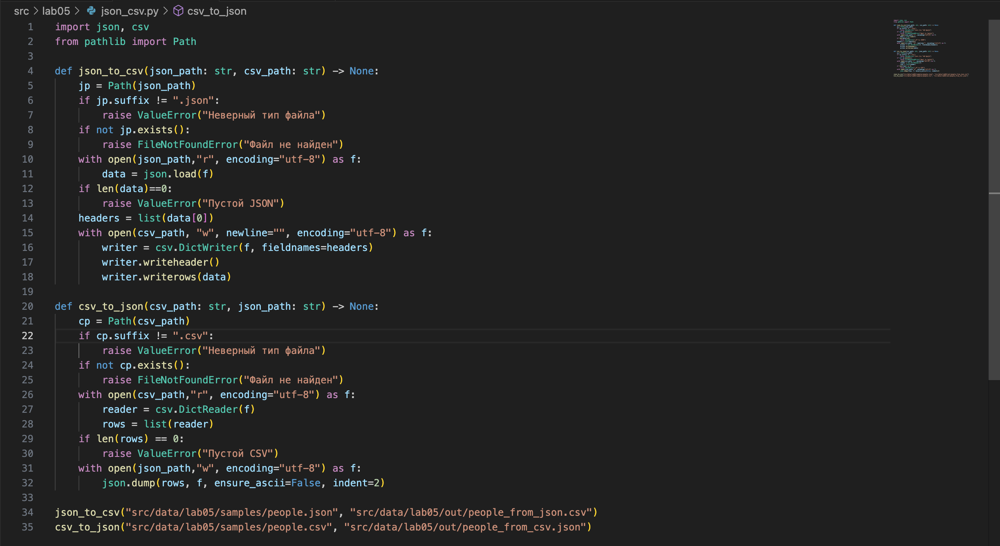

## Выполнение:

#### Перевод `CSV -> JSON`:

Исходный `src/data/lab05/samples/people.csv`


Результат перевода в JSON -> `src/data/lab05/out/people_from_csv.json`:
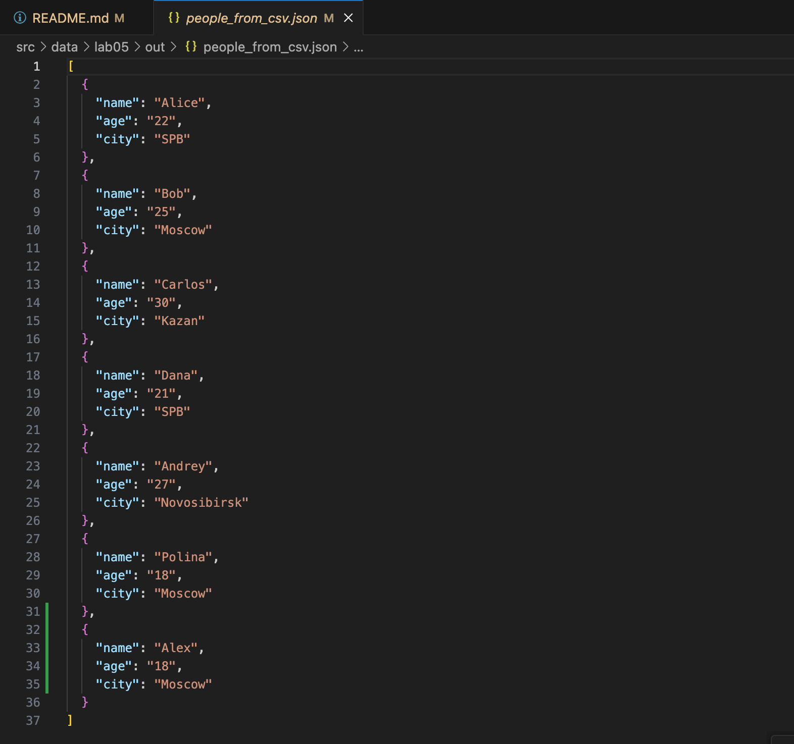

#### Перевод `JSON -> CSV`:

Исходный `src/data/lab05/samples/people.json`
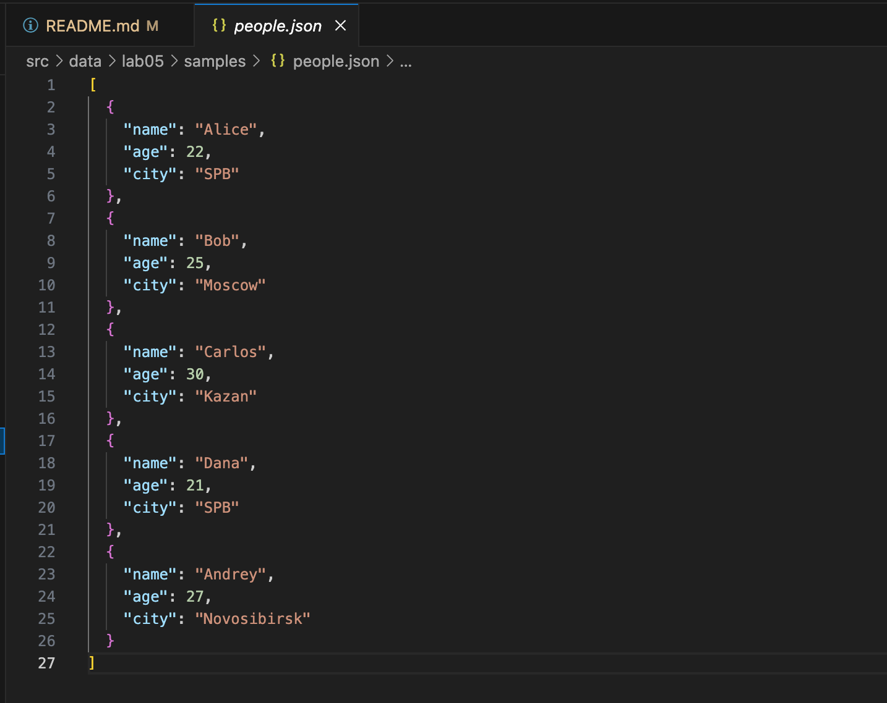

Результат перевода в CSV -> `src/data/lab05/out/people_from_json.csv`:
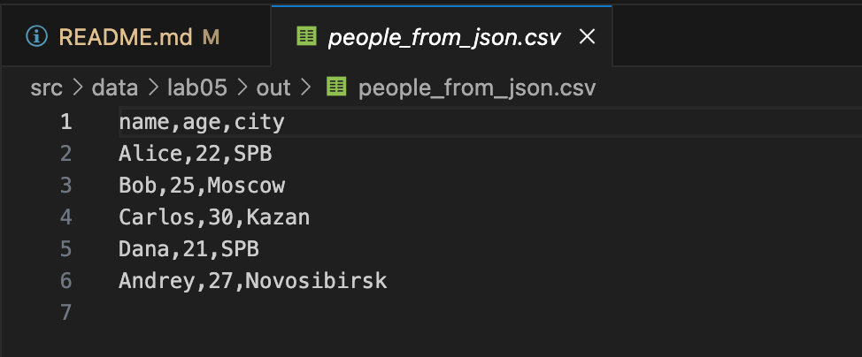


# Задание B — CSV → XLSX

```python
import csv
from pathlib import Path
from openpyxl import Workbook

def csv_to_xlsx(csv_path: str, xlsx_path: str) -> None:
    cp = Path(csv_path)
    if cp.suffix != ".csv":
        raise ValueError("Неверный тип файла")
    if not cp.exists():
        raise FileNotFoundError("Файл не найден")

    with open(csv_path, "r", encoding="utf-8") as f:
        reader = csv.reader(f)
        rows = list(reader)
    if len(rows)==0:
        raise ValueError("Пустой CSV")

    wb = Workbook()
    ws = wb.active
    ws.title = "Sheet1"
    for row in rows:
        ws.append(row)

    wb.save(xlsx_path)


csv_to_xlsx("src/data/lab05/samples/cities.csv", "src/data/lab05/out/cities.xlsx")
```
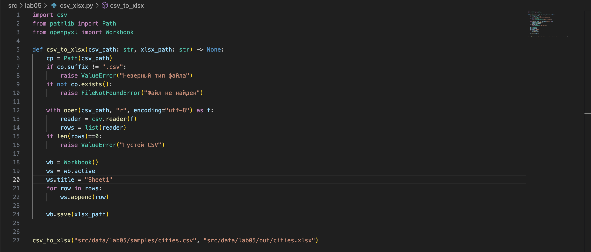

## Выполнение:

#### Перевод `CSV -> XLSX`:

Исходный `src/data/lab05/samples/cities.csv`
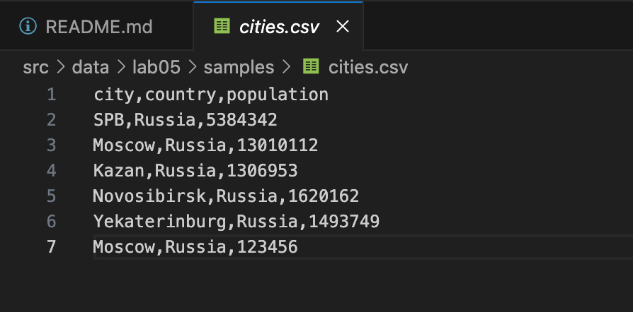

Результат перевода в XSLX -> `src/data/lab05/out/cities_xlsx`:
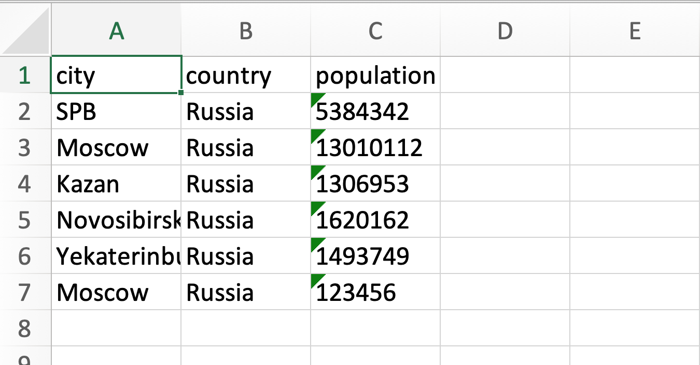

---

# ЛАБОРАТОРНАЯ РАБОТА №6

# Задание А — модуль `src/lab06/cli_text.py`
**Реализую модуль с подкомандами:** 
  - `stats --input <txt> [--top 5]` — анализ частот слов в тексте (использовны функции из `lab04`);
  - `cat --input <path> [-n]` — вывод содержимого файла построчно (с нумерацией при `-n`).

```python
import argparse
from pathlib import Path
from src.lib.text import normalize, tokenize, count_freq, top_n

def main():
    parser = argparse.ArgumentParser(description="CLI‑утилиты лабораторной №6")
    subparsers = parser.add_subparsers(dest="command", required=True)

    # подкоманда cat
    cat_parser = subparsers.add_parser("cat", help="Вывести содержимое файла")
    cat_parser.add_argument("--input", required=True)
    cat_parser.add_argument("-n", action="store_true", help="Нумеровать строки")

    # подкоманда stats
    stats_parser = subparsers.add_parser("stats", help="Частоты слов")
    stats_parser.add_argument("--input", required=True)
    stats_parser.add_argument("--top", type=int, default=5)

    args = parser.parse_args()

    if args.command == "cat":
        p = Path(args.input)
        if not p.exists():
            raise FileNotFoundError("Файл не найден")
        with p.open("r", encoding="utf-8") as f:
            for i, line in enumerate(f, 1):
                line = line.rstrip("\n")
                if args.n:
                    print(f"{i}\t{line}")
                else:
                    print(line)

    elif args.command == "stats":
        p = Path(args.input)
        if not p.exists():
            raise FileNotFoundError("Файл не найден")
        text = p.read_text(encoding="utf-8")
        tokens = tokenize(normalize(text))
        freq = count_freq(tokens)
        for word, count in top_n(freq, args.top):
            print(f"{word}:{count}")

if __name__ == "__main__":
    main()
```


# Задание B — модуль `src/lab06/cli_convert.py`
**Реализую модуль с подкомандами:** 
  - `json2csv --in data/samples/people.json --out data/out/people.csv`  
  - `csv2json --in data/samples/people.csv --out data/out/people.json`  
  - `csv2xlsx --in data/samples/people.csv --out data/out/people.xlsx`

```python
import argparse
from src.lab05.json_csv import json_to_csv, csv_to_json
from src.lab05.csv_xlsx import csv_to_xlsx

def main():
    parser = argparse.ArgumentParser(description="Конвертеры данных")
    sub = parser.add_subparsers(dest="cmd", required=True)

    p1 = sub.add_parser("json2csv", help="JSON -> CSV")
    p1.add_argument("--in", dest="input", required=True)
    p1.add_argument("--out", dest="output", required=True)

    p2 = sub.add_parser("csv2json", help="CSV -> JSON")
    p2.add_argument("--in", dest="input", required=True)
    p2.add_argument("--out", dest="output", required=True)

    p3 = sub.add_parser("csv2xlsx", help="CSV -> XLSX")
    p3.add_argument("--in", dest="input", required=True)
    p3.add_argument("--out", dest="output", required=True)

    args = parser.parse_args()

    if args.cmd == "json2csv":
        json_to_csv(args.input, args.output)
    elif args.cmd == "csv2json":
        csv_to_json(args.input, args.output)
    elif args.cmd == "csv2xlsx":
        csv_to_xlsx(args.input, args.output)

if __name__ == "__main__":
    main()
```


---