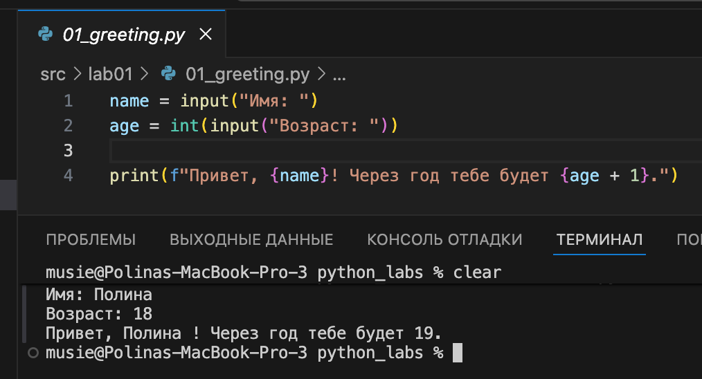

# Писаревская Полина Алексеевна БИВТ-25-4

# Лабораторные работы 

Данный репозиторий содержит мои решения лабораторных работ по предмету **Программирование и алгоритмизация**.  
Все задачи выполняются на языке **Python** и структурированы по папкам с лабораторными.

---

## Структура репозитория

```
python_labs/
├─ README.md           # краткое описание + примеры запуска
├─ src/                # здесь — все скрипты по заданиям
|  ├─ lab01
|  |   ├─ ex01.py
|  |   ├─ ex02.py
|  |   ........
|  |   └─ ex05.py
|  ├─ lab02
|  ........
|  └─ lab10
└─ images/             # сюда — скриншоты работы программ
   ├─ lab01
   |   ├─ img01.png
   |   ........
   |   └─ img05.png
   ├─ lab02
   ........
   └─ lab10
```

## Код — в src/, скриншоты — в images/.

---

# Лабораторные работа №1

# Задание 1 
```python
name = input("Имя: ")
age = int(input("Возраст: "))
print(f"Привет, {name}! Через год тебе будет {age + 1}.")
```


# Задание 2
```python
a = float(input("A: ").replace(",", "."))
b = float(input("B: ").replace(",", "."))
print(f"sum={a + b}; avg={(a + b) / 2}")
```


# Задание 3
```python
m = int(input("Минуты: "))
print(f"{m // 60:02d}:{m % 60:02d}")
```


# Задание 4
```python
price = float(input("Цена: "))
discount = float(input("Скидка: "))
vat = float(input("НДС: "))
base = price * (1 - discount / 100)
vat_amount = base * (vat / 100)
total = base + vat_amount
print(f"База после скидки: {base:.2f} ₽")
print(f"НДС: {vat_amount:.2f} ₽")
print(f"Итого к оплате: {total:.2f} ₽")
```


# Задание 5
```python
name = input("ФИО:").strip()
name1 = name.split()
name2 = ' '.join(name1)
print(f"Инициалы: {name1[0][0]}{name1[1][0]}{name1[2][0]}.")
print(f"Длина: {len(name2)}")
```


---

# Лабораторная работа №2


# Задание 1 -> arrays

# 1 min_max

```python
def min_max(nums: list[float | int]) -> tuple[float | int, float | int]:
    if len(nums) == 0:
        return ValueError
    mn = 9e6 
    mx = -9e6 
    for i in range(len(nums)):
        if nums[i] < mn:
            mn = nums[i]
        if nums[i] > mx:
            mx = nums[i]
    return tuple([mn, mx])
print(min_max())
```


# 2 unique_sorted

```python
def unique_sorted(nums1: list[float | int]) -> list[float | int]:
    unique_nums = set(nums1)
    return sorted(unique_nums)
print(unique_sorted())
```


# 3 flatten

```python
def flatten(mat: list[list | tuple]) -> list:
    arr = list()
    for a in mat:
        if not(isinstance(a, list) or isinstance(a, tuple)):
            return TypeError
        for el in a:
            arr.append(el)
    return arr 
print(flatten())
```


# Задание 2 -> matrix

# Вспомогательная функция 
## С ее помощью проверяю длину строк матрицы. Если длина строк разная, значит матрица - рваная, возвращаю ValueError.

```python
def dliny(mat):
    if any(len(mat[0]) != len(mat[s]) for s in range(len(mat))):
        return False
    return True
```

# 1 transpose

```python
def transpose(mat: list[list[float | int]]) -> list[list]:
    if len(mat) == 0:
        return []
    if dliny(mat) == False:
        return ValueError
    newmat = [[0 for stro in range(len(mat))] for stol in range(len(mat[0]))]
    for strok in range(len(mat)):
        for stolb in range(len(mat[strok])):
            newmat[stolb][strok] = mat[strok][stolb]
    return newmat
print(transpose())
```


# 2 row_sums

```python
def row_sums(mat: list[list[float | int]]) -> list[float]:
    if len(mat) == 0:
        return []
    if dliny(mat) == False:
        return ValueError
    sums = []
    for i in mat:
        sums.append(sum(i))
    return sums
print(row_sums())
```


# 3 col_sums

```python
def col_sums(mat: list[list[float | int]]) -> list[float]:
    if len(mat) == 0:
        return []
    if dliny(mat) == False:
        return ValueError
    sums = []
    row_len = len(mat[0])
    return [sum(row[j] for row in mat) for j in range(row_len)]
print(col_sums())
```


# Задание 3 -> tuples

```python
def format_record(rec: tuple[str, str, float]) -> str:
    name_processing = rec[0].strip().split()
    final_name = ''
    if len(name_processing) == 1:
        final_name = f"{name_processing[0][0].upper()}{name_processing[0][1:]}"
    elif len(name_processing) == 2:
        final_name = f"{name_processing[0][0].upper()}{name_processing[0][1:]} {name_processing[1][0:1].upper()}."
    elif len(name_processing) == 3:
        final_name = f"{name_processing[0][0].upper()}{name_processing[0][1:]} {name_processing[1][0:1].upper()}. {name_processing[2][0:1].upper()}."
    else:
        return ValueError
    group = ''
    group_processing = rec[1].strip()
    if group_processing == '':
        return ValueError
    else:
        group = group_processing
    gpa = float(rec[2])
    if not(isinstance(gpa, float)):
        return TypeError
    return f"{final_name}, гр. {group}, GPA: {gpa:.2f}"   
print(format_record(()))
```
