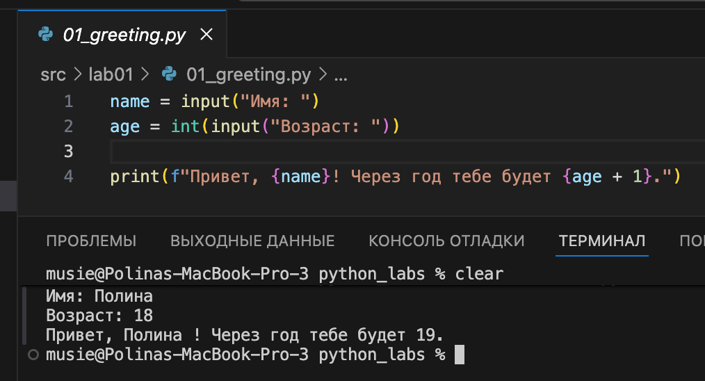
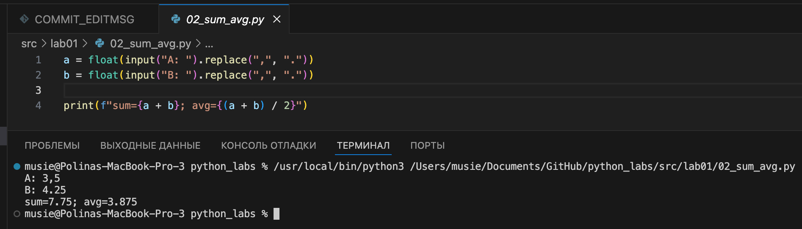
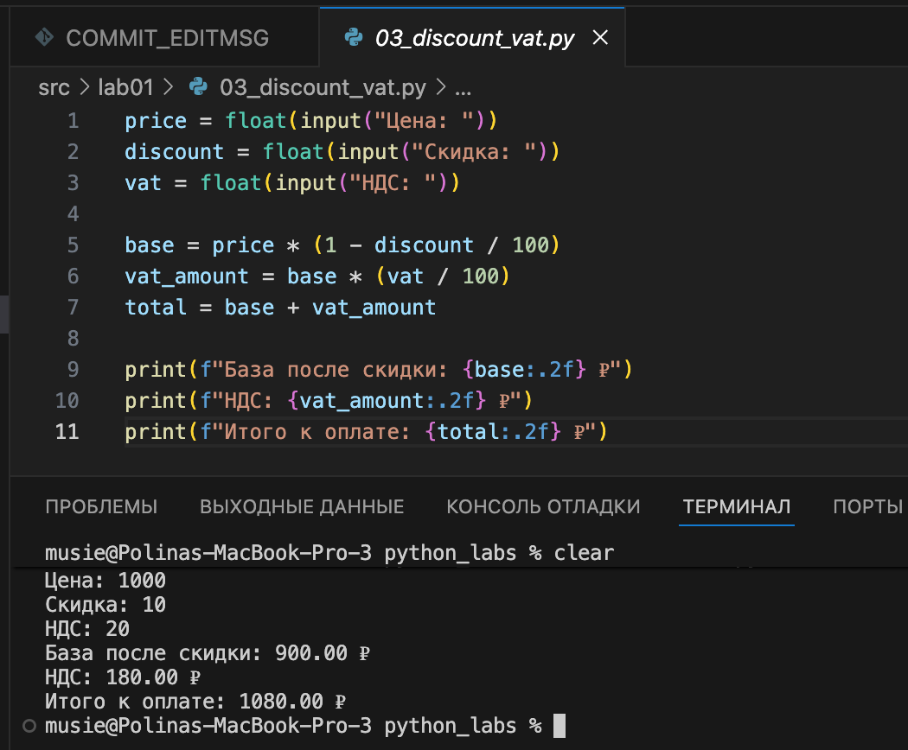
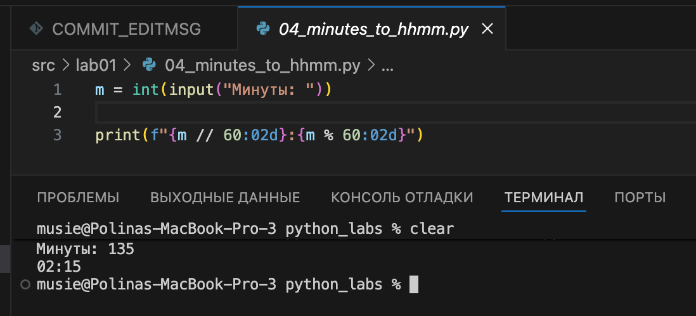
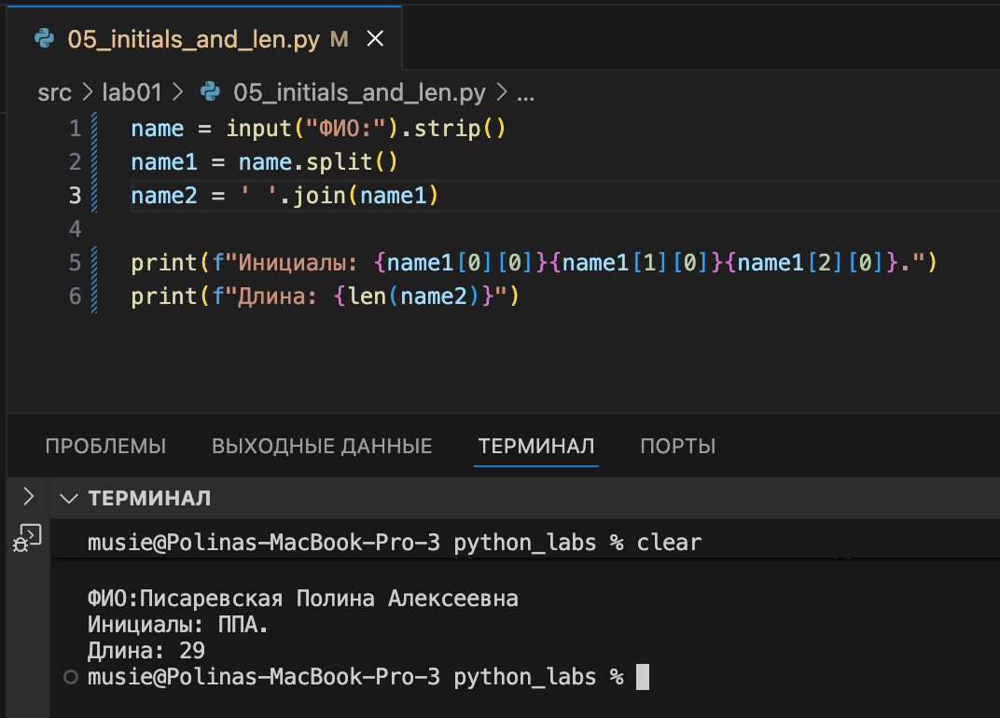

# ЛАБОРАТОРНАЯ РАБОТА №1

# Задание 1 
```python
name = input("Имя: ")
age = int(input("Возраст: "))
print(f"Привет, {name}! Через год тебе будет {age + 1}.")
```


# Задание 2
```python
a = float(input("A: ").replace(",", "."))
b = float(input("B: ").replace(",", "."))
print(f"sum={a + b}; avg={(a + b) / 2}")
```


# Задание 3
```python
m = int(input("Минуты: "))
print(f"{m // 60:02d}:{m % 60:02d}")
```


# Задание 4
```python
price = float(input("Цена: "))
discount = float(input("Скидка: "))
vat = float(input("НДС: "))
base = price * (1 - discount / 100)
vat_amount = base * (vat / 100)
total = base + vat_amount
print(f"База после скидки: {base:.2f} ₽")
print(f"НДС: {vat_amount:.2f} ₽")
print(f"Итого к оплате: {total:.2f} ₽")
```


# Задание 5
```python
name = input("ФИО:").strip()
name1 = name.split()
name2 = ' '.join(name1)
print(f"Инициалы: {name1[0][0]}{name1[1][0]}{name1[2][0]}.")
print(f"Длина: {len(name2)}")
```

