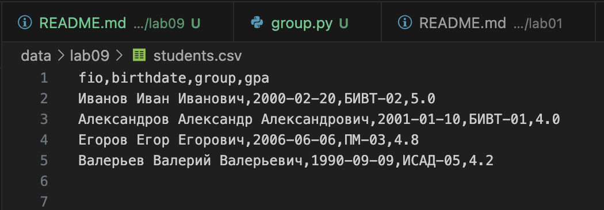
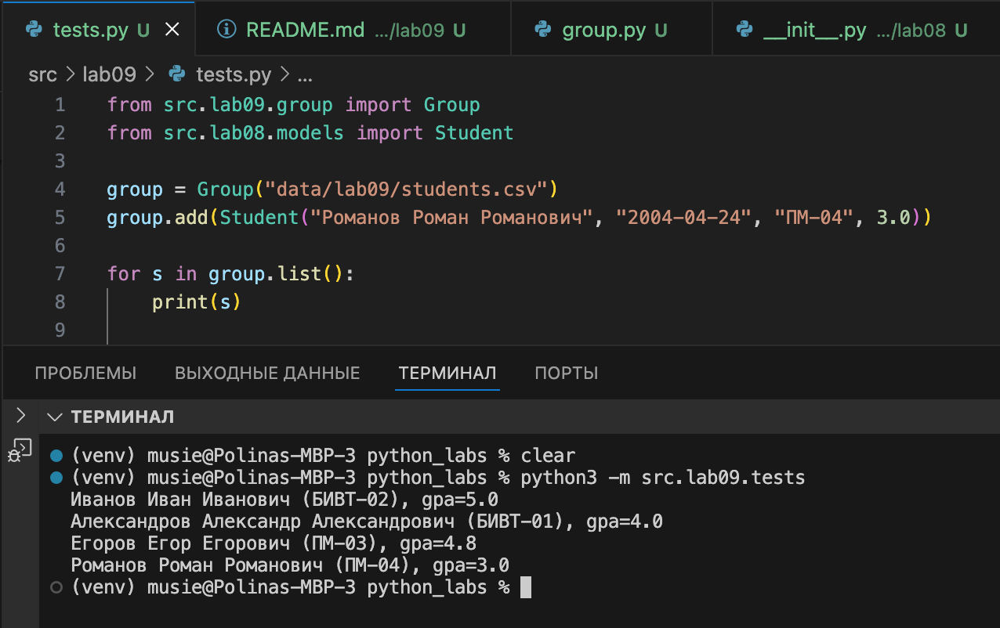
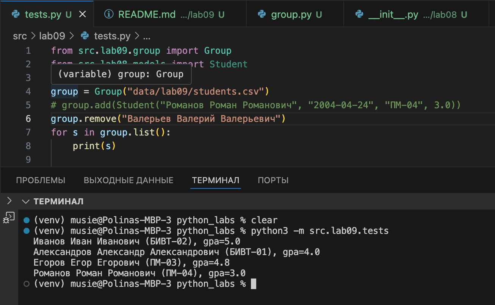
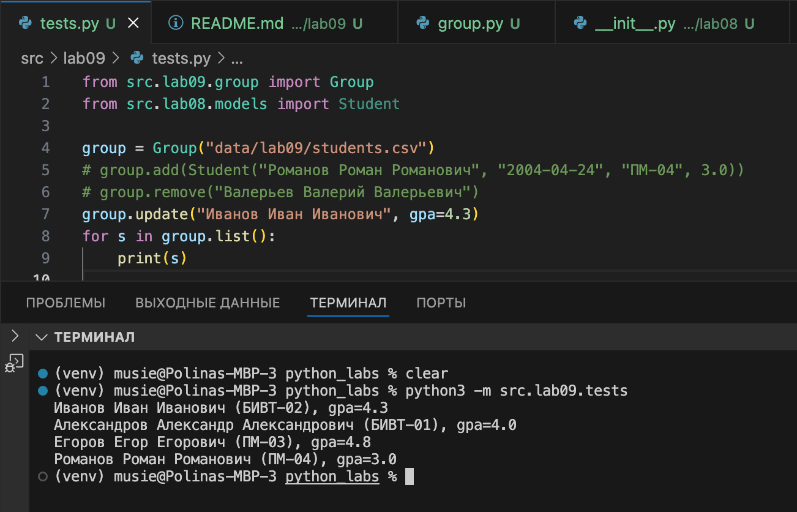

# ЛАБОРАТОРНАЯ РАБОТА №9

# Задание A — Реализовать класс **`Group`**, содержащий:
- методы:
  - `__init__(storage_path)` — инициализация группы и файла-хранилища
  - `list()` — вернуть **всех** студентов в виде списка `Student`
  - `add(student)` — добавить нового студента в CSV
  - `find(substr)` — найти студентов по подстроке в `fio`
  - `remove(fio)` — удалить запись(и) с данным `fio`
  - `update(fio, **fields)` — обновить поля существующего студента
**Файл:** `group.py`  
```
import csv
from pathlib import Path
from src.lab08.models import Student

class Group:
    def __init__(self, storage_path: str):
        self.path = Path(storage_path)
        self.fieldnames = ["fio", "birthdate", "group", "gpa"]
        if not self.path.exists():
            with open(self.path, "w", encoding="utf-8", newline="") as f:
                writer = csv.DictWriter(f, fieldnames=self.fieldnames)
                writer.writeheader()

    def _read_all(self):
        with open(self.path, "r", encoding="utf-8") as f:
            reader = csv.DictReader(f)
            return list(reader)

    def list(self):
        rows = self._read_all()
        return [
            Student(
                fio=row["fio"],
                birthdate=row["birthdate"],
                group=row["group"],
                gpa=float(row["gpa"]),
            )
            for row in rows
        ]

    def add(self, student: Student):
        with open(self.path, "a", encoding="utf-8", newline="") as f:
            writer = csv.DictWriter(f, fieldnames=self.fieldnames)
            writer.writerow(student.to_dict())

    def find(self, substr: str):
        students = self.list()
        result = []
        substr_lower = substr.lower()
        for s in students:
            if substr_lower in s.fio.lower():
                result.append(s)
        return result

    def remove(self, fio: str):
        rows = self._read_all()
        rows = [r for r in rows if r["fio"] != fio]
        with open(self.path, "w", encoding="utf-8", newline="") as f:
            writer = csv.DictWriter(f, fieldnames=self.fieldnames)
            writer.writeheader()
            writer.writerows(rows)

    def update(self, fio: str, **fields):
        rows = self._read_all()
        for r in rows:
            if r["fio"] == fio:
                for key, value in fields.items():
                    r[key] = value
        with open(self.path, "w", encoding="utf-8", newline="") as f:
            writer = csv.DictWriter(f, fieldnames=self.fieldnames)
            writer.writeheader()
            writer.writerows(rows)

```

### students.csv


## Результаты тестов:

### add


### remove


### update


