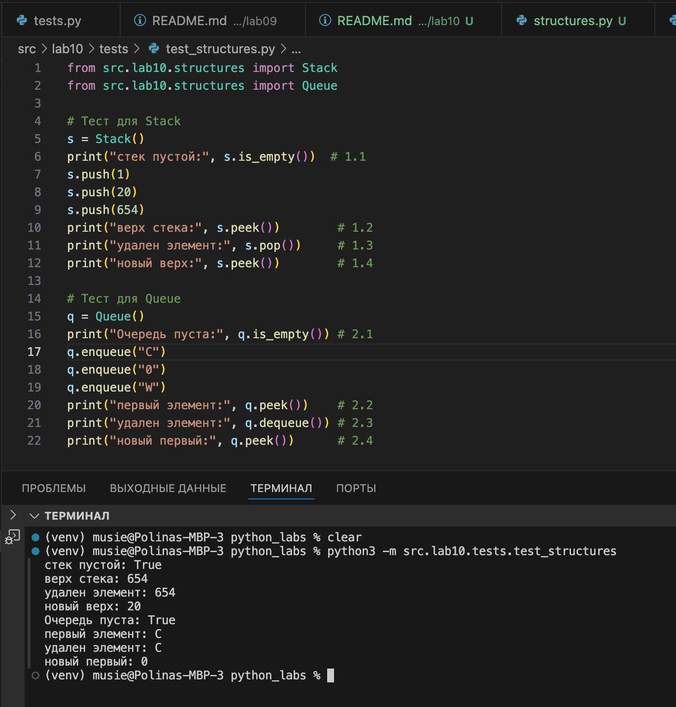
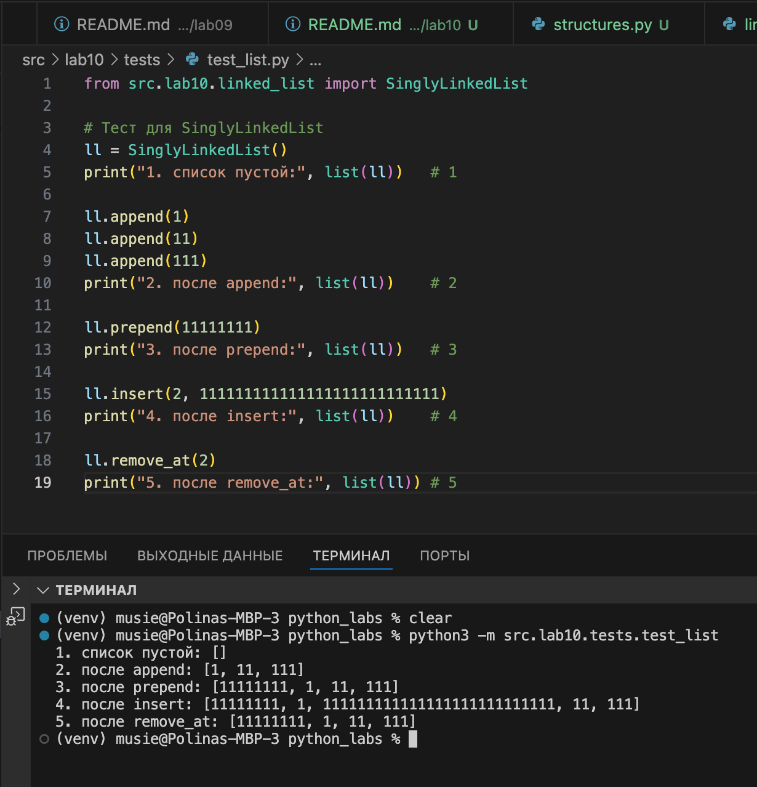

# ЛАБОРАТОРНАЯ РАБОТА №10

# Задание A — Реализовать `Stack` и `Queue`
**Методы:**
- `push(item) -> None`  - добавить элемент на вершину стека.
- `pop() -> Any` - снять верхний элемент стека и вернуть его.  
- `peek() -> Any | None` - вернуть верхний элемент **без удаления**.  
- `is_empty() -> bool` - вернуть `True`, если стек пуст, иначе `False`.
**Файл:** `structures.py`
```
from collections import deque

class Stack:
    def __init__(self):
        self._data = []

    def push(self, item):
        self._data.append(item) # добавить на вершину

    def pop(self):
        if self.is_empty():
            raise IndexError("стек пустой")
        return self._data.pop() # снять верхний

    def peek(self):
        if self.is_empty():
            return None
        return self._data[-1] # вернуть верхний без удаления

    def is_empty(self):
        return len(self._data) == 0 # вернуть True, если стек пуст

class Queue:
    def __init__(self):
        self._data = deque()

    def enqueue(self, item):
        self._data.append(item)  # добавить в конец очереди

    def dequeue(self):
        if self.is_empty():
            raise IndexError("очередь пустая")
        return self._data.popleft() # взять из начала очереди

    def peek(self):
        if not self._data:
            return None
        return self._data[0] # вернуть первый элемент без удаления

    def is_empty(self):
        return len(self._data) == 0 # вернуть True, если очередь пуста
```

# Задание В — Реализовать `SinglyLinkedList`
**Методы:**
- `append(value) -> None` - добавить элемент в конец списка.  
- `prepend(value) -> None` - добавить элемент в начало списка.
- `insert(idx: int, value) -> None` - вставить элемент по индексу `idx`.  
- `remove_at(idx: int) -> None` - удалить элемент по индексу `idx`.
- `__iter__(self)` - возвращает итератор по значениям в списке (в порядке от головы к хвосту).
- `__len__(self) -> int` - возвращает количество элементов (`self._size`).
- `__repr__(self) -> str` - возвращает строковое представление.
**Файл:** `linked_list.py`
```
class Node:
    def __init__(self, value, next=None):  # значение элемента и ссылка на следующий узел
        self.value = value
        self.next = next

class SinglyLinkedList:
    def __init__(self):     # голова списка и размер
        self.head = None
        self._size = 0

    def append(self, value): # добавить в конец
        new_node = Node(value)
        if self.head is None:
            self.head = new_node
            self._size = 1
            return

        current = self.head
        while current.next is not None:
            current = current.next

        current.next = new_node
        self._size += 1

    def prepend(self, value): # добавить в начало
        new_node = Node(value, next=self.head)
        self.head = new_node
        self._size += 1

    def insert(self, idx, value): # вставка по индексу
        if idx < 0 or idx > self._size:
            raise IndexError("index out of range")

        if idx == 0:
            self.prepend(value)
            return

        if idx == self._size:
            self.append(value)
            return

        current = self.head
        for _ in range(idx - 1):
            current = current.next

        new_node = Node(value, next=current.next)
        current.next = new_node
        self._size += 1

    def remove_at(self, idx): # удалить по индексу
        if idx < 0 or idx >= self._size:
            raise IndexError("index out of range")

        if idx == 0:
            self.head = self.head.next
            self._size -= 1
            return

        current = self.head
        for _ in range(idx - 1):
            current = current.next

        current.next = current.next.next
        self._size -= 1

    def __iter__(self): # пройти по списку
        current = self.head
        while current is not None:
            yield current.value
            current = current.next

    def __len__(self): # размер списка
        return self._size

    def __repr__(self): # вывод списка
        values = list(self)
        return f"SinglyLinkedList({values})"
```

## Результаты тестов:

### Stack и Queue
###  Запуск из терминала: `python3 -m src.lab10.tests.test_structures`


### SinglyLinkedList
###  Запуск из терминала: `python3 -m src.lab10.tests.test_list`

